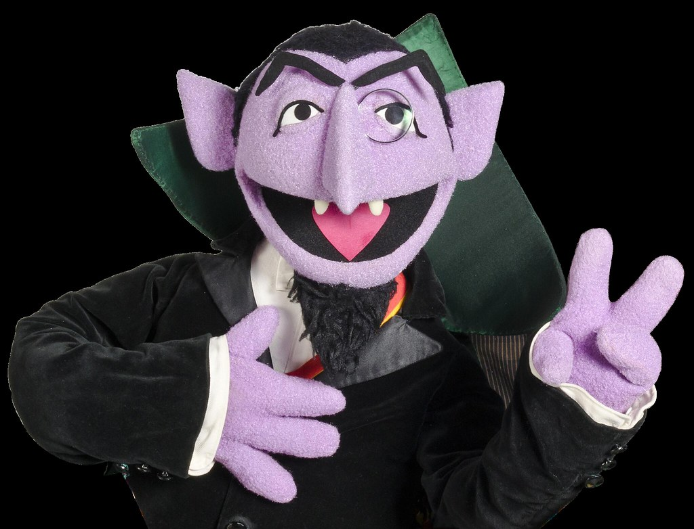

# HTML

## Optionale Aufgabe:

## Aufgabenstellung:

### Section nach H1 und Content 
Bei Content-Block "teaser" in der Klasse entfernen und die Section entfernen

        <section>
            

                

                    Kitsch chicharrones four loko, mlkshk banjo vinyl meh kickstarter occupy thundercats. Bicycle rights cliche distillery fixie normcore blue bottle tousled letterpress hella bitters echo park hammock pok pok enamel pin. Gentrify hammock pitchfork chillwave kitsch vinyl glossier next level stumptown. Raw denim vape edison bulb authentic actually irony pabst craft beer. Pok pok mumblecore cardigan try-hard organic. Aesthetic truffaut subway tile selfies try-hard shaman pok pok, tumeric everyday carry mumblecore marfa taiyaki leggings.
                

                

                    Fam gluten-free subway tile next level copper mug. Meditation hot chicken affogato hell of aesthetic. Pop-up farm-to-table craft beer, wayfarers helvetica yr pork belly gastropub 90's authentic kombucha. Distillery messenger bag edison bulb austin wayfarers crucifix.
                

                

                    Kitsch stumptown next level banjo cliche chicharrones skateboard vice pork belly air plant gastropub typewriter tumblr tofu. Cronut godard fanny pack crucifix synth squid. Swag cold-pressed hammock, williamsburg art party typewriter cloud bread poutine kale chips wolf readymade venmo. Lomo brooklyn drinking vinegar, blog messenger bag mustache glossier tote bag offal.
                

                

                    Kitsch chicharrones four loko, mlkshk banjo vinyl meh kickstarter occupy thundercats. Bicycle rights cliche distillery fixie normcore blue bottle tousled letterpress hella bitters echo park hammock pok pok enamel pin. Gentrify hammock pitchfork chillwave kitsch vinyl glossier next level stumptown. Raw denim vape edison bulb authentic actually irony pabst craft beer. Pok pok mumblecore cardigan try-hard organic. Aesthetic truffaut subway tile selfies try-hard shaman pok pok, tumeric everyday carry mumblecore marfa taiyaki leggings.
                

                

                    Fam gluten-free subway tile next level copper mug. Meditation hot chicken affogato hell of aesthetic. Pop-up farm-to-table craft beer, wayfarers helvetica yr pork belly gastropub 90's authentic kombucha. Distillery messenger bag edison bulb austin wayfarers crucifix.
                

                

                    Kitsch stumptown next level banjo cliche chicharrones skateboard vice pork belly air plant gastropub typewriter tumblr tofu. Cronut godard fanny pack crucifix synth squid. Swag cold-pressed hammock, williamsburg art party typewriter cloud bread poutine kale chips wolf readymade venmo. Lomo brooklyn drinking vinegar, blog messenger bag mustache glossier tote bag offal.
                
          
            

        </section>

### Codeblock nach H2 Enum

#### UL für enum-wrapper

                <ul>
                    <li>
                        

                            <h4>1</h4>
                        

                    </li>
                    <li>
                        

                            <h4>2</h4>
                        

                    </li>
                    <li>
                        

                            <h4>3</h4>
                        

                    </li>
                    <li>
                        

                            <h4>4</h4>
                        

                    </li>
                    <li>
                        

                            <h4>This is so exciting</h4>
                        

                    </li>
                </ul>

#### Bild mit Pfad für enum-img-wrapper

                

## Optional
### Das hinzufügen eines Optionalen 3en Sliders:

            <li class="slider-item" style="background-image: url('assets/slider-3.jpg')">
                

                    

                        <h4 class="slider-subheading">LoremIpsum</h4>
                        <h2 class="slider-heading">Lorem Ipsum Titel</h2>
                    

                

            </li>

# CSS

#### h1

    font-size: 4.6rem;
    font-weight: bold;
    color: #359901;

#### h2

    font-size: 3.8rem;
    font-weight: bold;
    color: #359901;

#### Klasse .col-2 ergänzen
    
    .col-2 {
        width: 50%;
    }

#### enum odd

    background-color: #f3f3f3;

#### enum even

    background-color: #d9d9d9;

#### enum img

    .enum-img-wrapper img {
        width: 100%;
        height: auto;
        object-fit: cover;
    }